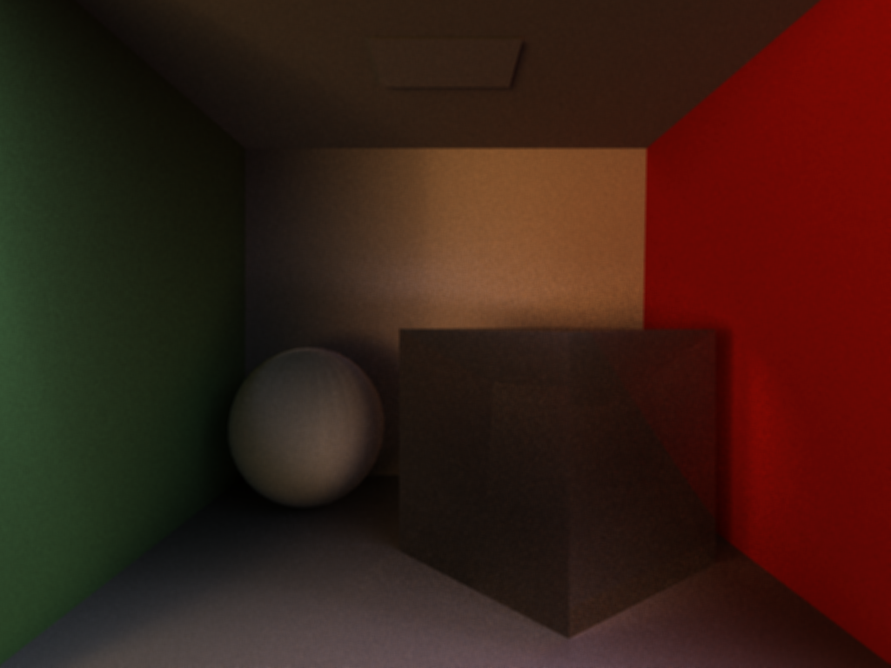

# arendur


[](https://crates.io/crates/arendur)

Just Another Renderer. This time in Rust though.

This is a project guided by [pbrt](http://www.pbrt.org/). Its on `0.0.5` for the time being, with a functional path-tracing based renderer.

A sample scene rendered by the command line interface prototype `arencli` in `./examples`, with 1024 samples per pixel, using a (modified) Cornell Box modification created by [Guedis Cardenas and Morgan McGuire at Williams College, 2011](http://graphics.cs.williams.edu/data)):




To tinker with it you can either clone the source code with `git`:

```sh
   $ git clone https://github.com/DaseinPhaos/arendur.git
   $ cd arendur
```

or simply grab it from crates.io.

Once grabbed, `arencli` can be built with

```sh
cargo build --example arencli --release
```

Note that the newest nightly version of Rust is needed.


## What's next

Goals before 0.1:

- [x] a console interface (implemented as `./examples/arencli.rs`)
- [x] area lights
- [ ] more materials
- [ ] a bidirectional path tracing based renderer
- [ ] refine the [docs](http://docs.rs/arendur)

## Contributing

Contribution/guidance appreciated!

## License

This project is distributed under the terms of both the MIT license and the Apache License (Version 2.0).

See [LICENSE-APACHE](LICENSE-APACHE), [LICENSE-MIT](LICENSE-MIT) for details.
